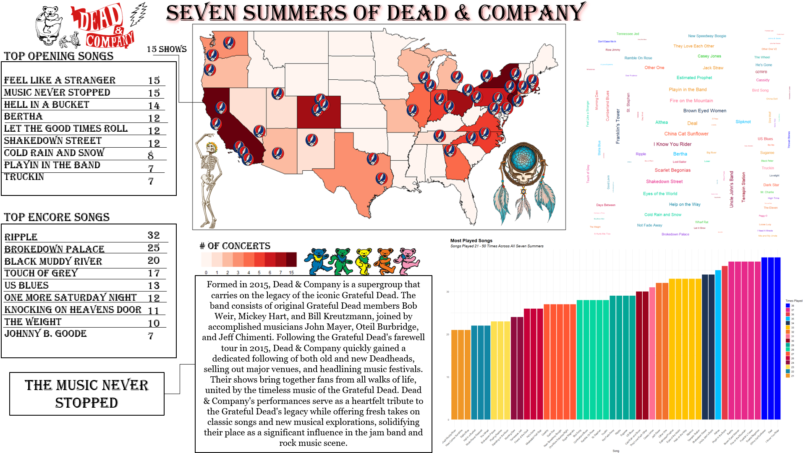

```{r setup, include=FALSE}
## Global options
knitr::opts_chunk$set(cache = TRUE)
```


```{r a, echo = FALSE,warning = FALSE, include = FALSE}

library(tidyverse)
library(sf)
library(leaflet)
library(tmap)
library(tmaptools)
library(circlize)
library(wordcloud)
library(gridExtra)
library(grid)
library(png)

```


```{r b, echo = FALSE,warning = FALSE, include = FALSE}

color_palette <- c("#46ACC8", "#377EB8", "#4DAF4A", "#984EA3", "#FF7F00", "#550307",
                   "#A65628", "#F781BF", "#999999", "#66C2A5", "#273046","#FD6467", 
                   "#A6D854", "#FFD92F", "#0B775E")

opening_palette <- c("#E41A1C", "#377EB8", "#4DAF4A", "#984EA3", "#FF7F00", "#FFFF33",
                     "#F781BF", "#999999", "#66C2A5", "#FC8D62", "#8DA0CB", "#FDBF6F", 
                     "#B3B3CC", "#CC79A7", "#1B9E77", "#D95F02", "#7570B3", "#E7298A",
                     "#66A61E", "#E6AB02", "#A6761D", "#666666", "#1B78B8", "#E31A1C", 
                     "#FD8D3C", "#7C7C7C")

encore_palette <- c("#FF0000", "#FF7F00", "#00FF00", "#00FFFF", "#0000FF", 
                    "#8B00FF", "#FF00FF", "#FF1493", "#FF4500", "#FFD700", 
                    "#32CD32", "#00CED1", "#4169E1", "#800080", "#FFC0CB", 
                    "#00FF7F", "#FFA500", "#FFFF00", "#8A2BE2", "#00BFFF", 
                    "#FF69B4", "#7FFF00", "#FF6347", "#FFA07A", "#8FBC8F")

```


```{r img1, echo=FALSE, fig.cap="Dead & Co Poster", out.width='50%'}



```

## Overview

Born from the ashes of their iconic predecessors, Dead & Company channels the heart and soul of the Grateful Dead, captivating legions of devoted Deadheads worldwide. Their awe-inspiring performances have woven an eternal bond with their ardent fans, who have traversed time and space to follow their melodic odyssey.Drawing upon the boundless potential of R's data manipulation prowess, we unfurl the tour setlists spanning seven captivating summers. Our quest begins with dynamic leaflet maps that whisk you away on a virtual journey, guiding you through the transcendent venues and harmonious landscapes where Dead & Company's symphonic magic danced under the stars. Each concert is a celestial point, forming an enchanting constellation of memories etched into the fabric of American soil. Venturing deeper, we illuminate the band's timeless anthems through insightful bar graphs that paint a vivid portrait of the most frequented melodies. Witness the sonic phenomena that have etched themselves into the hearts of Deadheads, resonating with an ineffable power that defies the hands of time. And then, we unveil a majestic choropleth map, a kaleidoscopic tapestry of colors dancing across the map of the United States. Each hue represents the frequency of concerts in every state, a testament to the band's unwavering connection with fans spanning the nation.The journey reaches its poetic crescendo with an enchanting poster that summarizes our journey using maps, word clouds, bar graphs, and the uncovering of the secret encores and grand openings that crowned each summer's cosmic expedition. Marvel at the song selection sorcery that left fans spellbound, elevating the euphoria of each concert into a breathtaking crescendo. each a lyrical constellation, adorning the cosmos with the most-played songs from every celestial tour. Behold the poetic brilliance of lyrics woven into captivating visuals, where the essence of Dead & Company's music shines with unparalleled brilliance.

With bated breath and hearts aflutter, we invite you to traverse this mesmerizing landscape of music, passion, and soul. Our love letter to Dead & Company's legacy, woven with the finesse of R and the ardor of dedicated Deadheads, is a testament to the enduring magic that has bewitched generations of music lovers. Join us on this exhilarating escapade, where data and artistry coalesce to honor a band whose melody and spirit transcend time itself.

Prepare to embark on a thrilling adventure as we delve into the extraordinary world of Dead & Company's enchanting summer tours! With boundless enthusiasm, we unlock the magic of their musical journey through a mesmerizing tapestry of interactive maps, mesmerizing bar graphs, ethereal word clouds, and captivating choropleth maps. Powered by the magic of R and an arsenal of data visualization wizardry, we embark on an awe-inspiring exploration of the band's illustrious touring history from the awe-inspiring year of 2016 to the spellbinding realm of 2023.

If you would like to play around with things we cover or try something new all the data used in this project is available to download [HERE](https://www.dropbox.com/s/z81r5819e8haoqb/DeadnCo.zip?dl=0)

## Part I. Data Collection and Preprocessing

The foundation of our project rests on meticulous data collection, where we obtained tour setlists for each summer from 2016 to 2023. These datasets were processed using R's data manipulation capabilities, specifically the tidyverse package, allowing us to clean, filter, and transform the data into a format suitable for visualization.

In this section, we unveil the cornerstone of our project—meticulous data collection and pre-processing. Our journey commences with the acquisition of tour setlists for each summer spanning from 2016 to 2023. Armed with the might of R's data manipulation prowess, we harness the power of the tidyverse package to skillfully clean, filter, and transform the datasets, molding them into a format primed for captivating visualizations.

Because I was using an already established geo-database it did not contain certain cities that we need so I had to create new shapefiles of missing points, give them unique ID codes, and filter out repeating cities. It got quite messy so I will not include that here as it would make this document much longer but everything I gloss over here is available in the projects zip file. 

```{r c, echo = FALSE, warning = FALSE, include = FALSE}

states <- st_read("shapefiles/states/states.shp") %>%
  st_transform(crs = 4326)

cities <- st_read("shapefiles/USA_Cities/US_Cities.shp") %>%
  st_transform(crs = 4326)

missing_points <- st_read("shapefiles/missing_points/bethel_wheatland.shp") %>%
  st_transform(crs = 4326)

george <- cities %>%
  filter(NAME == "George")
george$FID_1 <- 9999

bristow <- cities %>%
  filter(NAME == "Bristow")
bristow$FID_1 <- 9998

burgettstown <- cities %>%
  filter(NAME == "Burgettstown")
burgettstown$FID_1 <- 9997

clarkston <- cities %>%
  filter(NAME == "Clarkston")
clarkston$FID_1 <- 9996

darien <- cities %>%
  filter(NAME == "Darien Center")
darien$FID_1 <- 9995

troy <- cities %>%
  filter(NAME == "East Troy")
troy$FID_1 <- 9994

Foxborough <- cities %>%
  filter(NAME == "Foxborough")
Foxborough$FID_1 <- 9993

hollywood <- cities %>%
  filter(NAME == "Hollywood")
hollywood$FID_1[2] <- 9992
hollywood <- hollywood %>%
  filter(!ST == "FL")

mansfield <- cities %>%
  filter(NAME == "Mansfield")

mansfield <- mansfield %>%
  filter(FID_1 == 9991)

morrison <- cities %>%
  filter(NAME == "Morrison")
morrison$FID_1 <- 9990

found_places <- bind_rows(bristow, burgettstown, clarkston, darien, 
                          Foxborough, george, hollywood, mansfield, morrison, 
                          troy, missing_points)

found_places <- found_places %>%
  filter(!ST == "FL")

found_places$FID_1[11] <- 9988

cities <- bind_rows(cities, found_places) %>%
  filter(!FID_1 == 0)

cities <- cities %>%
  filter(!FID_1 == 9988)

bethel <- missing_points %>%
  filter(NAME == "Bethel")
bethel$FID_1 <- 9988

cities <- bind_rows(cities, bethel)

```

## Part II. Interactive Maps with Leaflet

Now, with our data primed and ready, we dive deep into the enchanting world of Dead & Company's captivating summer tour of 2016. Leverage the power of interactive mapping through the Leaflet package, we traverse the musical tapestry woven across the nation's landscapes. Marvel at the radiant constellation of concerts—each a celestial point, emblematic of a moment where magic unfolded beneath the stars.

This is only the beginning of our spellbinding expedition, as we venture onward to explore the mystique of subsequent summers, basking in the euphoric glory that continues to bind Dead & Company with their ever-devoted Deadheads. Let us embrace the essence of their legacy, a fusion of data and artistry that reverberates with the timeless magic of music.

For the sake of keeping this brief I will share how I made the leaflet 2016 tour map. Every other map is pretty rinse and repeat so it shouldn't be too difficult for yourself to make a leaflet map of other tour years. Or if you don't want to make your own you can find leaflet maps inside of the **maps** folder inside of the project zip file.


```{r d, echo = TRUE, warning = FALSE, include = TRUE}

tour16 <- read.csv("summer_tours/summer2016.csv")

summer16_cities <- cities %>%
  filter(FID_1 == 2264|FID_1 == 3511|FID_1 == 2382|FID_1 == 301|
           FID_1 == 3405|FID_1 == 2215|FID_1 == 9998|FID_1 == 2174|
           FID_1 == 726|FID_1 == 661|FID_1 == 9996|FID_1 == 9994|
           FID_1 == 9997|FID_1 == 1437|FID_1 == 2913|FID_1 == 9999|
           FID_1 == 1165|FID_1 == 1052|FID_1 == 9989|FID_1 == 452)
summer16_cities$FID_1[15:19] <- 0

summer16_cities <- summer16_cities %>%
  filter(!FID_1 == 0)

tour16$Show_num <- as.factor(tour16$Show_num)
levels(tour16$Show_num)

setlists16 <- tour16 %>%
  group_by(Show_num) %>%
  summarize(setlist = paste(Song, collapse = "<br>"))

tour16_with_geometry <- left_join(tour16, summer16_cities[, c("FID_1", "geometry")], by = "FID_1")

```


```{r e, echo = TRUE,warning = FALSE, include = TRUE}

# Extract latitude and longitude from geometry column
tour16_with_geometry$latitude <- st_coordinates(tour16_with_geometry$geometry)[, 2]
tour16_with_geometry$longitude <- st_coordinates(tour16_with_geometry$geometry)[, 1]

tour16_with_geometry <- tour16_with_geometry[complete.cases(tour16_with_geometry$latitude, tour16_with_geometry$longitude), ]

# Convert tour18_with_geometry to sf object
tour16_with_geometry_sf <- st_as_sf(tour16_with_geometry, coords = c("longitude", "latitude"), crs = 4326)

# Transform the sf object to WGS84
tour16_with_geometry_sf <- st_transform(tour16_with_geometry_sf, crs = 4326)

# Group the songs by FID_1 and concatenate them into a single string
setlist16 <- tour16_with_geometry_sf %>%
  group_by(FID_1) %>%
  summarize(setlist = paste(Song, collapse = "<br>"))

# Merge the setlist data with the tour23_with_geometry_sf
tour16_with_setlist <- st_join(tour16_with_geometry_sf, setlist16)

```

This is a critical step as for whatever reason while adding and dropping geometry some cities and their setlists are lost so its key that we get those back. This happened for Boston and Chicago almost every time. 

```{r f, echo = TRUE,warning = FALSE, include = TRUE}

# Missing cities; Boston, Portland, George, Wheatland
# Boston
missing_bos16 <- setlist16 %>%
  filter(FID_1 == 1437)
missing_bos16_df <- as.data.frame(missing_bos16)
tour16_with_setlist <- tour16_with_setlist %>%
  dplyr::left_join(missing_bos16_df[, c("FID_1", "setlist")], by = c("FID_1.x" = "FID_1")) %>%
  dplyr::mutate(setlist = ifelse(!is.na(setlist.y), setlist.y, setlist.x)) %>%
  dplyr::select(-setlist.x, -setlist.y)
# Portland
missing_por16 <- setlist16 %>%
  filter(FID_1 == 2913)
missing_por16_df <- as.data.frame(missing_por16)
tour16_with_setlist <- tour16_with_setlist %>%
  dplyr::left_join(missing_por16_df[, c("FID_1", "setlist")], by = c("FID_1.x" = "FID_1")) %>%
  dplyr::mutate(setlist = ifelse(!is.na(setlist.y), setlist.y, setlist.x)) %>%
  dplyr::select(-setlist.x, -setlist.y)
# George
missing_geo16 <- setlist16 %>%
  filter(FID_1 == 9999)
missing_geo16_df <- as.data.frame(missing_geo16)
tour16_with_setlist <- tour16_with_setlist %>%
  dplyr::left_join(missing_geo16_df[, c("FID_1", "setlist")], by = c("FID_1.x" = "FID_1")) %>%
  dplyr::mutate(setlist = ifelse(!is.na(setlist.y), setlist.y, setlist.x)) %>%
  dplyr::select(-setlist.x, -setlist.y)
# Wheatland
missing_whe16 <- setlist16 %>%
  filter(FID_1 == 9989)
missing_whe16_df <- as.data.frame(missing_whe16)
tour16_with_setlist <- tour16_with_setlist %>%
  dplyr::left_join(missing_whe16_df[, c("FID_1", "setlist")], by = c("FID_1.x" = "FID_1")) %>%
  dplyr::mutate(setlist = ifelse(!is.na(setlist.y), setlist.y, setlist.x)) %>%
  dplyr::select(-setlist.x, -setlist.y)


tour16_with_setlist$latitude <- st_coordinates(tour16_with_setlist$geometry)[, 2]
tour16_with_setlist$longitude <- st_coordinates(tour16_with_setlist$geometry)[, 1]

```


```{r g, echo = TRUE,warning = FALSE, include = TRUE}

map16 <- leaflet() %>%
  addTiles(group = "OSM") %>%
  addProviderTiles("Esri.WorldGrayCanvas", group = "ESRI") %>%
  addProviderTiles("CartoDB.DarkMatter", group = "CartoDB") %>%
  addPolygons(data = states, color = "grey", fill = FALSE, weight = 2,
              highlight = highlightOptions(weight = 3, color = "white", bringToFront = FALSE), popup = FALSE) %>%
  addCircleMarkers(data = tour16_with_setlist, radius = 8, stroke = FALSE, fillOpacity = 1,
                   lat = ~latitude, lng = ~longitude, popup = ~setlist, group = "Tour16",
                   color = color_palette[as.numeric(factor(tour16_with_setlist$Location))]) %>%
  setView(lat = 39, lng = -100, zoom = 4) %>%
  addLayersControl(
    baseGroups = c("OSM", "ESRI", "CartoDB"),
    options = layersControlOptions(collapsed = FALSE))

encore_songs16 <- tour16_with_setlist[tour16_with_setlist$Set.Type == "Encore", ]
encore_songs16 <- sf::st_drop_geometry(encore_songs16)

encore_agg16 <- encore_songs16 %>%
  group_by(Location) %>%
  summarize(encore_setlist = paste(Song, collapse = "<br>"))

# Merge aggregated encore songs with tour16_with_setlist
tour16_with_setlist <- left_join(tour16_with_setlist, encore_agg16, by = "Location")

map16 <- map16 %>%
  addCircleMarkers(data = tour16_with_setlist, radius = 8, stroke = FALSE, fillOpacity = 1,
                   lat = ~latitude, lng = ~longitude, popup = ~encore_setlist, group = "Encore Songs",
                   color = encore_palette)

# Add layers control
map16 <- map16 %>%
  addLayersControl(
    overlayGroups = c("Tour16", "Encore Songs"),
    options = layersControlOptions(collapsed = FALSE),
    baseGroups = c("OSM", "ESRI", "CartoDB"),
    position = "topright"
  )

opening_songs16 <- tour16_with_setlist[tour16_with_setlist$Song.Order == 1, ]
opening_songs16 <- sf::st_drop_geometry(opening_songs16)

opening_agg16 <- opening_songs16 %>%
  group_by(Location) %>%
  summarize(opening_setlist = paste(Song, collapse = "<br>"))

tour16_with_setlist <- left_join(tour16_with_setlist, opening_agg16, by = "Location")

map16 <- map16 %>%
  addCircleMarkers(data = tour16_with_setlist, radius = 8, stroke = FALSE, fillOpacity = 1,
                   lat = ~latitude, lng = ~longitude, popup = ~opening_setlist, group = "Opening Songs",
                   color = opening_palette)
map16 <- map16 %>%
  addLayersControl(
    overlayGroups = c("Tour16", "Encore Songs", "Opening Songs"),
    options = layersControlOptions(collapsed = FALSE),
    baseGroups = c("OSM", "ESRI", "CartoDB"),
    position = "topright"
  )

```

And there you have it! An interactive map that contains all shows from the Summer 2016 tour and Layer controls to filter though the entire setlist! There are also layer controls for the base-map as well so you can get it to suit your visual preferences. Once again if you want to see other interactive maps you can find them in the **maps** folder

```{r h, echo = FALSE,warning = FALSE, include = TRUE}
map16
```

## Part III. Vector Based Analysis Using tmap

Witness the grandeur of a choropleth map, where the nation's states are adorned with hues, each representing the frequency of concerts held in every state. Delight in the vibrant tapestry of colors that celebrate the bond between Dead & Company and their devoted followers across the country.

Once again we have some annoying data cleaning to do, as it is quite intensive I have decided to spare you from scrolling through it.

```{r i, echo = FALSE,warning = FALSE, include = FALSE}

tour17 <- read.csv("summer_tours/summer2017.csv")
tour17$Show_num <- as.factor(tour17$Show_num)
levels(tour17$Show_num)
tour18 <- read.csv("summer_tours/summer2018.csv")
tour18$Show_num <- as.factor(tour18$Show_num)
levels(tour18$Show_num)
tour19 <- read.csv("summer_tours/summer2019.csv")
tour19$Show_num <- as.factor(tour19$Show_num)
levels(tour19$Show_num)
tour21 <- read.csv("summer_tours/summer2021.csv")
tour21$Show_num <- as.factor(tour21$Show_num)
levels(tour21$Show_num)
tour22 <- read.csv("summer_tours/summer2022.csv")
tour22$Show_num <- as.factor(tour22$Show_num)
levels(tour22$Show_num)
tour23 <- read.csv("summer_tours/summer2023.csv")
tour23$Show_num <- as.factor(tour23$Show_num)
levels(tour23$Show_num)

```


```{r j, echo = FALSE,warning = FALSE, include = FALSE}

summer17_cities <- cities %>%
  filter(FID_1 == 3364|FID_1 == 910|FID_1 == 9992|FID_1 == 452|FID_1 == 3830|
           FID_1 == 661|FID_1 == 1879|FID_1 == 9997|FID_1 == 1437|FID_1 == 2215|
           FID_1 == 9998|FID_1 == 2174|FID_1 == 3405|FID_1 == 2390|FID_1 == 63)

summer18_cities <- cities %>%
  filter(FID_1 == 9991|FID_1 == 3405|FID_1 == 2382|FID_1 == 301|FID_1 == 1879|FID_1 == 2318|FID_1 == 2215|FID_1 == 726|
           FID_1 == 2174|FID_1 == 9995|FID_1 == 2390|FID_1 == 9994|FID_1 == 9999|FID_1 == 2887|FID_1 == 452|FID_1 == 1052|
           FID_1 == 415|FID_1 == 2037|FID_1 == 661)

summer19_cities <- cities %>%
  filter(FID_1 == 452|FID_1 == 9992|FID_1 == 9999|FID_1 == 301|FID_1 == 63|
           FID_1 == 2215|FID_1 == 3405|FID_1 == 9993|FID_1 == 2174|FID_1 == 9998|
           FID_1 == 2264|FID_1 == 3592|FID_1 == 3592|FID_1 == 661 |FID_1 == 1879)

summer21_cities <- cities %>%
  filter(FID_1 == 2318|FID_1 == 9998|FID_1 == 2174|FID_1 == 2987|
           FID_1 == 9988|FID_1 == 9995|FID_1 == 2215|FID_1 == 2962|
           FID_1 == 9991|FID_1 == 726|FID_1 == 2390|FID_1 == 9996|
           FID_1 == 2382|FID_1 == 3296|FID_1 == 301|FID_1 == 63|
           FID_1 == 2264|FID_1 == 1879|FID_1 == 3592|FID_1 == 3754|
           FID_1 == 9990|FID_1 == 677|FID_1 == 910|FID_1 == 1052|FID_1 == 9992)

summer22_cities <- cities %>%
  filter(FID_1 == 415|FID_1 == 452|FID_1 == 661|FID_1 == 3296|FID_1 == 2382|
           FID_1 == 63|FID_1 == 301|FID_1 == 9996|FID_1 == 9988|
           FID_1 == 9993|FID_1 == 726|FID_1 == 9998|FID_1 == 2987|
           FID_1 == 9997|FID_1 == 2174)

summer23_cities <- cities %>%
  filter(FID_1 == 2132|FID_1 == 1164|FID_1 == 910|FID_1 == 3592|
           FID_1 == 1879|FID_1 == 2264|FID_1 == 2318|FID_1 == 9998|
           FID_1 == 9997|FID_1 == 3296|FID_1 == 63|FID_1 == 2382|
           FID_1 == 2987|FID_1 == 2215|FID_1 == 2174|FID_1 == 1437 |
           FID_1 == 301|FID_1 == 661|FID_1 == 9999|FID_1 == 554)

```


```{r k, echo = FALSE,warning = FALSE, include = FALSE}

summer17_cities$FID_1[13:15] <- 0
summer17_cities <- summer17_cities %>%
  filter(!FID_1 == 0)


summer18_cities$FID_1[c(17,18,16,19)] <- 0
summer18_cities <- summer18_cities %>%
  filter(!FID_1 == 0)

summer19_cities$FID_1[11:14] <- 0 
summer19_cities <- summer19_cities %>%
  filter(!FID_1 == 0)

summer21_cities$FID_1[19:24] <- 0 
summer21_cities <- summer21_cities %>%
  filter(!FID_1 == 0)

summer22_cities$FID_1[11:14] <- 0
summer22_cities <- summer22_cities %>%
  filter(!FID_1 == 0)

summer23_cities$FID_1[18:20] <- 0
summer23_cities <- summer23_cities %>%
  filter(!FID_1 == 0)

```


```{r l, echo = FALSE,warning = FALSE, include = FALSE}

# Rename the columns in 'tour19' and 'tour23' to match the other datasets
colnames(tour19) <- colnames(tour16)
colnames(tour23) <- colnames(tour16)

# Combine all the datasets using rbind()
all_tours <- rbind(tour16, tour17, tour18, tour19, tour21, tour22, tour23)

# Check the structure of the combined dataset
str(all_tours)

# Combine data frames row-wise
all_cities <- rbind(summer16_cities, summer17_cities, summer18_cities,
                    summer19_cities, summer21_cities, summer22_cities)

all_cities$ST[15] <- "VA"
all_cities$ST[16] <- "PA"
all_cities$ST[17] <- "MI"
all_cities$ST[18] <- "WA"
all_cities$ST[19] <- "WI"
all_cities$ST[20] <- "CA"
all_cities$ST[33] <- "VA"
all_cities$ST[34] <- "PA"
all_cities$ST[35] <- "CA"
all_cities$ST[51] <- "NY"
all_cities$ST[52] <- "WA"
all_cities$ST[53] <- "MA"
all_cities$ST[54] <- "WI"
all_cities$ST[65] <- "VA"
all_cities$ST[66] <- "MA"
all_cities$ST[67] <- "WA"
all_cities$ST[68] <- "CA"
all_cities$ST[87] <- "VA"
all_cities$ST[88] <- "MA"
all_cities$ST[89] <- "NY"
all_cities$ST[90] <- "CA"
all_cities$ST[91] <- "MA"
all_cities$ST[92] <- "CO"
all_cities$ST[93] <- "NY"
all_cities$ST[104] <- "VA"
all_cities$ST[105] <- "PA"
all_cities$ST[106] <- "MI"
all_cities$ST[107] <- "MA"
all_cities$ST[108] <- "NY"


```

Now that our data is cleaned up we can start to manipulate some things and get all of our required data in the right place.

```{r m, echo = FALSE,warning = FALSE, include = TRUE}

# Count the number of shows played in each state
state_counts <- table(all_cities$ST)

# Convert the result to a data frame
state_counts_df <- as.data.frame(state_counts,  responseName = "num_shows")

# Rename the 'ST' column to 'State' for consistency
state_counts_df <- rename(state_counts_df, ST = Var1)

# Remove duplicate rows based on the "NAME" column
unique_cities <- all_cities %>% distinct(NAME, .keep_all = TRUE)

# Merge the state_counts_df into the unique_cities data frame based on the 'ST' column
unique_cities_counts <- merge(unique_cities, state_counts_df, by = "ST", all.x = TRUE)

# Convert unique_cities_counts data frame to an sf object
unique_cities_counts_sf <- st_as_sf(unique_cities_counts, coords = c("longitude", "latitude"))

# Perform a left_join to merge unique_cities_counts_sf into states based on STATE_ABBR and ST
merged_states <- st_join(states, unique_cities_counts_sf)

# Replace NA values in num_shows column with 0
merged_states$num_shows[is.na(merged_states$num_shows)] <- 0


merged_states$num_shows <- as.factor(merged_states$num_shows)

```


Using tmap and our aggregated data we can finally use **tmap** to visualize all the places Dead & Company have visited over the past 7 summers!

```{r n, echo = TRUE,warning = FALSE, include = TRUE}

dead_tmap <- tm_shape(merged_states) +
  tm_polygons(col = "num_shows", palette = "Reds", title = "", legend.show = FALSE) +
  tm_shape(merged_states) +
  tm_fill(col = "num_shows", palette = "Reds", 
  title = "# of concerts", legend.is.portrait = FALSE) +
  tm_shape(states) +
  tm_borders(col = "#000000", lwd = 1) +
  tm_shape(unique_cities_counts) +
  tm_bubbles(size = 0.25, col = "#8A2BE2") +
  tm_layout(legend.outside.position = "bottom",legend.outside.size = 0.35,legend.outside = TRUE, 
            main.title = "Seven Summers of Dead & Company",
            main.title.position = "center", 
            main.title.fontface = "bold",
            legend.text.size = 0.8)


```

```{r o, echo = TRUE,warning = FALSE, include = TRUE}

dead_tmap

```

## Part IV. Wordcloud

Time to set up a vibrant color palette cloud_palette for word clouds, which will be utilized to visually represent song frequencies from different Dead & Company summer tours.

```{r p, echo = FALSE,warning = FALSE, include = TRUE}

cloud_palette <- c("#FF0000", "#FF7F00", "#00FF00", "#00FFFF", "#0000FF", 
                   "#8B00FF", "#FF00FF", "#FF1493", "#FF4500", "#FFD700", 
                    "#32CD32", "#00CED1", "#4169E1", "#800080", "#FFC0CB", 
                    "#00FF7F", "#FFA500", "#FFFF00", "#8A2BE2", "#00BFFF", 
                    "#FF69B4", "#7FFF00", "#FF6347", "#FFA07A", "#8FBC8F")

```

This code chunk filters out Drums & Space. The reason being that it is performed at every show and would clearly result in being the largest word in our cloud so we'll just take those out (sorry Mickey).
```{r q, echo = FALSE,warning = FALSE, include = TRUE}

summer16_no_ds <- tour16[!(tour16$Song %in% c("Drums", "Space")), ]
summer17_no_ds <- tour17[!(tour17$Song %in% c("Drums", "Space")), ]
summer18_no_ds <- tour18[!(tour18$Song %in% c("Drums", "Space")), ]
summer19_no_ds <- tour19[!(tour19$Song %in% c("Drums", "Space")), ]
summer21_no_ds <- tour21[!(tour21$Song %in% c("Drums", "Space")), ]
summer22_no_ds <- tour22[!(tour22$Song %in% c("Drums", "Space")), ]
summer23_no_ds <- tour23[!(tour23$Song %in% c("Drums", "Space")), ]

```

Next I calculate song frequency for each tour. Once again this is very rinse and repeat so it will not be included here but you can get an idea of what I did for each tour in the next code chunk which is more condense than this. 
```{r r, echo = FALSE,warning = FALSE, include = FALSE}

# Calculate song frequency 
song_freq16 <- summer16_no_ds %>%
  count(Song) %>%
  arrange(desc(n))
song_freq17 <- summer17_no_ds %>%
  count(Song) %>%
  arrange(desc(n))
song_freq18 <- summer18_no_ds %>%
  count(Song) %>%
  arrange(desc(n))
song_freq19 <- summer19_no_ds %>%
  count(Song) %>%
  arrange(desc(n))
song_freq21 <- summer21_no_ds %>%
  count(Song) %>%
  arrange(desc(n))
song_freq22 <- summer22_no_ds %>%
  count(Song) %>%
  arrange(desc(n))
song_freq23 <- summer23_no_ds %>%
  count(Song) %>%
  arrange(desc(n))


```

The code combines song frequency data from multiple years into a single data frame (all_song_freq). It then aggregates the total frequency for each song and sorts the data frame in descending order based on the total frequency.

```{r s, echo = TRUE,warning = FALSE, include = TRUE}

#Combine song frequency data from multiple years
all_song_freq <- rbind(song_freq16, song_freq17, song_freq19,song_freq21, song_freq22, song_freq23)
# Aggregate total frequency for each song
total_freq <- aggregate(n ~ Song, data = all_song_freq, sum)
# Sort the data frame by total frequency in descending order
total_freq <- arrange(total_freq, desc(n))

```

Finally, this segment generates an impressive word cloud (total_cloud) representing the combined song frequencies from all the summer tours. The word cloud visually highlights the most frequently performed songs throughout the years. The color palette color_palette2 adds visual appeal to the word cloud, capturing the essence of Dead & Company's diverse musical repertoire.

```{r t, echo = TRUE,warning = FALSE, include = TRUE}

color_palette2 <- c("#0000FF", "#E7298A", "#E63946", "#00BFFF", "#1D3557", "#32CD32",
                    "#F3722C", "#FF6F91", "#9A031E", "#03A696", "#06D6A0", "#FF5733",
                    "#C70039", "#900C3F", "#8A2BE2", "#1287A5", "#F09727")

max_words2 <- 156

total_cloud <- wordcloud(words = total_freq$Song[1:max_words2], freq = total_freq$n[1:max_words2],
                         scale = c(1.5, 0.3), colors = color_palette2, bg = "white", rot.per = 0.2,
                         random.order = FALSE, min.freq = 1, max.words = max_words2,
                         random.color = TRUE, rotate.min = -45, rotate.max = 45,
                         ordered.colors = FALSE, use.r.layout = FALSE, asp = 0.75,
                         family = "plain", par.settings = list(cex = 0.8, col = "darkblue"))

```


After doing a little data exploration of my own I decided to at the very least share what I've found:
*All songs contain links to Youtube videos of their respective performances*

**Top 10 Most Frequent Songs**

["China Cat Sunflower"](https://www.youtube.com/watch?v=gkdPzk1l1OI) - 38 times

["Deal"](https://www.youtube.com/watch?v=gwhZDyBaJVQ) - 38 times

["I Know You Rider"](https://www.youtube.com/watch?v=gxgsCJa0aGw) - 38 times

["Bertha"](https://www.youtube.com/watch?v=bEw_dizx2HY) - 37 times

["Brown Eyed Women"](https://www.youtube.com/watch?v=MaAQRaMQe_8) - 37 times

["Fire on the Mountain"](https://www.youtube.com/watch?v=TFkhaeqZo6o) - 37 times

["Franklin's Tower"](https://www.youtube.com/watch?v=hSO6AichiRY) - 37 times

["Scarlet Begonias"](https://www.youtube.com/watch?v=_rgOciZeHKw) - 37 times

["Playin in the Band"](https://www.youtube.com/watch?v=eayvYUD8JLY) - 36 times

["Althea"](https://www.youtube.com/watch?v=2L5qA9PEeQw) - 35 times - (Johnny Kills It On This One)


**Rare Songs:**

["Maggie's Farm"](https://www.youtube.com/watch?v=8_tvc9C4USI) - 1 time

["My Favorite Things"](https://www.youtube.com/watch?v=D7zYUfIeSY4) - 1 time

["In The Midnight Hour"](https://www.youtube.com/watch?v=GZ31hU60Q6w) - 2 times

["Deep Elem Blues"](https://www.youtube.com/watch?v=2n5Njv6IFDU) - 2 times

["Death Dont Have No Mercy"](https://www.youtube.com/watch?v=jz0G8KigL10) - 3 times

["Promised Land"](https://www.youtube.com/watch?v=EeRTrAaTpzk) - 3 times

["Candyman"](https://www.youtube.com/watch?v=ruz-8OugqL0) - 4 times

["Little Red Rooster"](https://www.youtube.com/watch?v=yOzTJLt1fJs) - 4 times

["Dont Ease Me In"](https://www.youtube.com/watch?v=8L8lV_qC3fQ) - 5 times

["Man Smart, Women Smarter"](https://www.youtube.com/watch?v=c5GhtFusHW0) - 5 times


## Part V. Barchart

```{r u, echo = FALSE,warning = FALSE, include = TRUE}

top_n_songs <- total_freq[1:50, ]

```

```{r v, echo = FALSE,warning = FALSE, include = TRUE}

# Define custom colors for different occurrences
occurrences_colors <- c("#457B9D", "#1B9E77", "#D95F02", "#7570B3", "#E7298A",
                        "#66A61E", "#E6AB02", "#A6761D", "#666666", "#1B78B8",
                        "#E31A1C", "#FD8D3C", "#7C7C7C", "#FF7F00", "#FFFF33",
                        "#F781BF", "#66C2A5")

```

```{r w, echo = TRUE,warning = FALSE, include = TRUE}

# Create the bar plot with custom fill colors
dead_plot <- ggplot(top_n_songs, aes(x = reorder(Song, n), y = n, fill = factor(n))) +
  geom_bar(stat = "identity") +
  scale_fill_manual(values = occurrences_colors) +  # Apply custom fill colors
  labs(x = "Song", y = "", title = "Top 50 Songs",
       subtitle = "Across All Seven Tours") +
  theme_minimal() +
  theme(axis.text.x = element_text(angle = 45, hjust = 1, vjust = 1),
        plot.title = element_text(size = 18, face = "bold"),
        plot.subtitle = element_text(size = 14, face = "italic"))

```

```{r x, echo = TRUE, warning = FALSE, include = TRUE}
dead_plot
```


We have explored the frequency of encore performances and opening songs in Dead & Company's summer tours. We extracted data on songs played during encores and those chosen to kick start the musical journey during each concert. These insights provide a comprehensive view of the band's song selection and their emphasis on creating memorable experiences for their audiences. The data presented here unveils the diversity and magic that is woven into each performance.

```{r y, echo = FALSE,warning = FALSE, include = TRUE}

all_encore <- all_tours %>%
  filter(Set.Type == "Encore") %>%
  select(Song, Set.Type)
str(all_encore)
library(dplyr)

# Group the data by the Song and Set.Type columns and calculate the number of times each song was played as an Encore
all_encore <- all_encore %>%
  group_by(Song, Set.Type) %>%
  summarise(times_played = n())

```

```{r z, echo = TRUE,warning = FALSE, include = TRUE}
head(all_encore)
```

```{r aa, echo = FALSE,warning = FALSE, include = TRUE}
all_openers <- all_tours %>%
  filter(Song.Order == 1) %>%
  select(Song, Song.Order)
str(all_openers)
library(dplyr)

# Group the data by the Song and Set.Type columns and calculate the number of times each song was played as an Encore
all_openers <- all_openers %>%
  group_by(Song, Song.Order) %>%
  summarise(times_played = n())
```

```{r bb, echo = TRUE,warning = FALSE, include = TRUE}
head(all_openers)
```

As we traversed the musical tapestry woven across the nation's landscapes, we witnessed the enduring power and brilliance of Dead & Company. Their captivating performances, born from the heart and soul of the Grateful Dead, have forged an eternal bond with devoted Deadheads worldwide. The band's ability to create enchanting musical experiences, each concert a celestial point in the constellation of memories, speaks to their exceptional talent and enduring legacy.

Our love letter to Dead & Company's legacy would not have been possible without the ardent fans and music enthusiasts who joined us on this thrilling adventure. To those who took the time to explore with us, we extend our deepest gratitude. Your passion for music and dedication to the magic of Dead & Company inspired us throughout this journey. As we bid farewell to this captivating exploration, we carry with us the joy of music, the allure of data, and the harmony that transcends time and space.

Thank you for joining us on this exhilarating escapade! Your presence has made this journey all the more enchanting, and we hope the magic of Dead & Company's music continues to resonate with you for years to come. As we celebrate their legacy, may the melodies and spirit of Dead & Company ignite a timeless flame in the hearts of music lovers everywhere.

Farewell, dear friends, until the next musical odyssey calls us to venture into the unknown once more. The magic of music awaits, and we eagerly anticipate the harmonious adventures that lie ahead. Let us continue to cherish the melodies that have touched our souls and celebrate the enduring legacy of Dead & Company with boundless enthusiasm.

With deepest gratitude,

DC

## Part VI. Aknowledgements, Data Sources, & Useful Links 

Download this project [HERE](https://www.dropbox.com/s/z81r5819e8haoqb/DeadnCo.zip?dl=0)

Data for tours was sourced from the [Dead & Company Database](http://www.deadandcodb.com/)

Spatial data and skills were learned from [West Virginia View](http://www.wvview.org/os_sa.html) 

Another great resource for learning R in a different context can be found [HERE](https://docs.google.com/spreadsheets/u/0/d/1LPe8xYduoep9qCrNzBGdJHaHZ8dnmdHNnu7UXZKzawU/htmlview#)

One of my favorite sites that contains (maybe?) the largest access to Grateful Dead shows can be found [HERE](https://gratefuldeadoftheday.com/)

Connect with me on [Twitter](https://twitter.com/Domantci), [LinkedIn](https://www.linkedin.com/in/dominick-cifelli-782589193/), and [Github](https://github.com/dac0009)